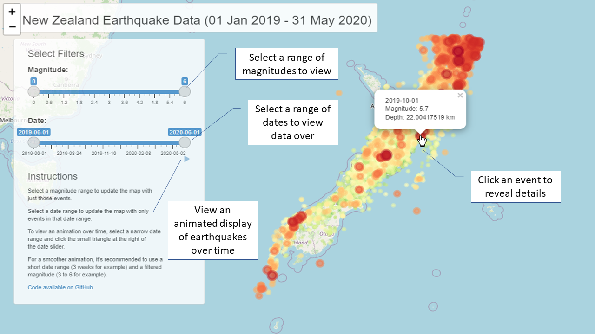

```{r setup, include=FALSE}
knitr::opts_chunk$set(
	echo = FALSE,
	message = FALSE,
	warning = FALSE
)
library(plotly)
library(dplyr)
```

## Features

The NZEQ app is an interactive map that shows earthquakes published by NZ GeoNet.

-   Zoom in on areas of interest
-   Show only earthquakes of certain magnitude
-   Filter by date
-   Play an animated presentation showing earthquakes in a given time width
-   Click an event to reveal date, magnitude and depth

## Easy to Use

{width="100%"}

## Easy to Update

Built with standard NZ GeoNet data publicly available, update to add more dates and data at any time.

```{r data, echo = FALSE, comment=""}
load('./nzeq/data/nzeq.Rdata')
summary(nzeq)
```

## Rich Data Analysis Possibilities

```{r depth, fig.height=5, fig.width=8}
nzeq %>%
    mutate(longitude=if_else(longitude<0,360+longitude, longitude)) %>%
    mutate(longitude = 0-round(longitude,1)) %>%
    mutate(latitude = 0-round(latitude,1)) %>%
    group_by(longitude, latitude) %>%
    summarise(depth=-mean(depth)/10) %>%
    plot_ly(z = ~xtabs(depth ~ longitude + latitude)) %>%
    add_surface(colorbar=list(title='Depth'))%>% 
    layout(title = list(text = '\nNZ Earthquakes by Depth (06-2019 to 05-2020)'),
           scene = list(
               zaxis = list(title = "<b>Depth (x10km)</b>"),
               xaxis = list(title = "<b>Longtitude</b>", showticklabels = FALSE),
               yaxis = list(title = '<b>Latitude (S)</b>', showticklabels = FALSE)
           ),
           legend = list(title=list(text='<b>Depth</b>'))
    )
```
